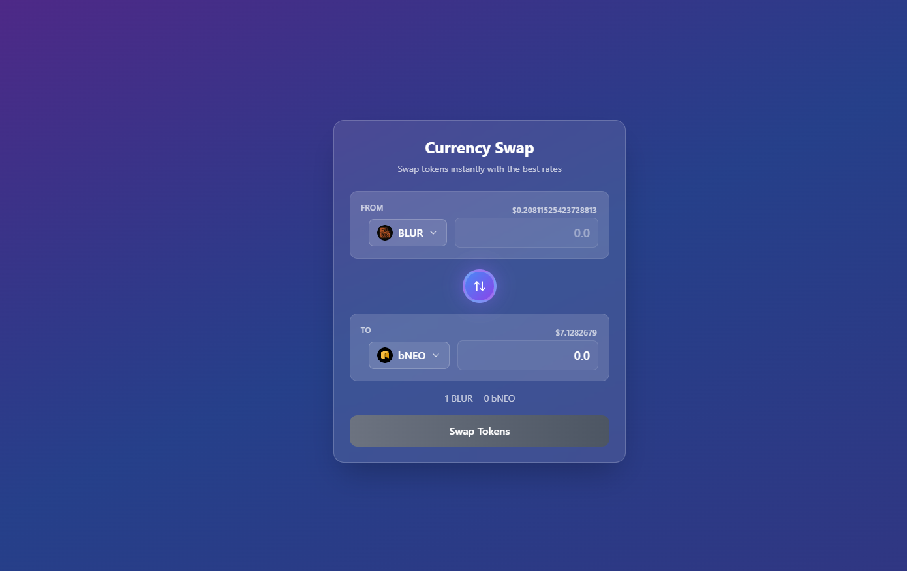
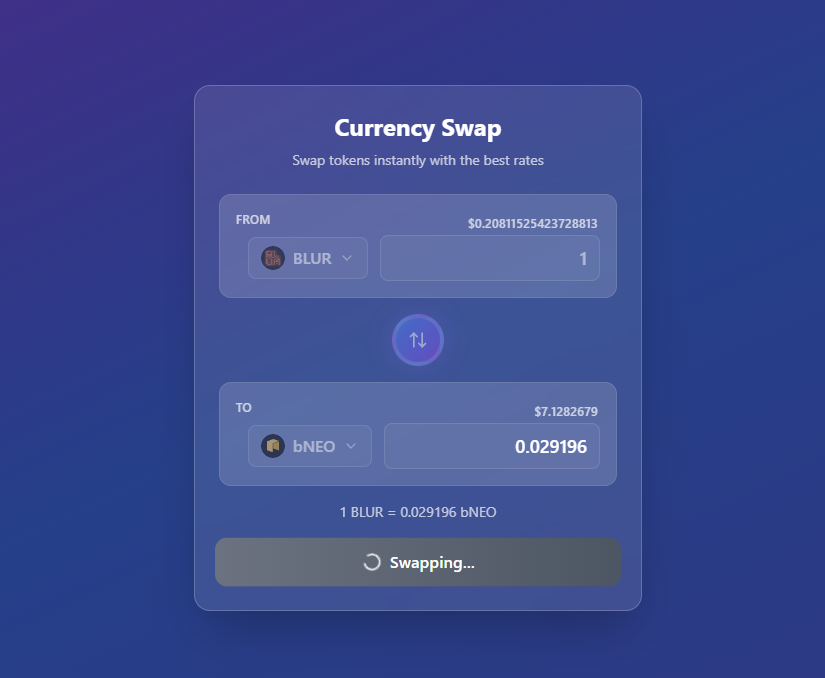
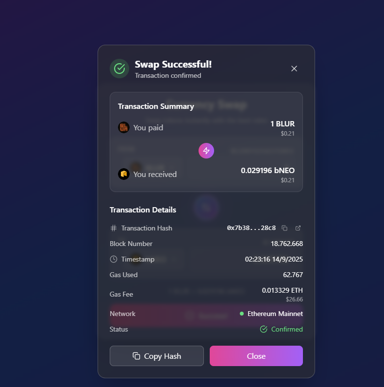

# 99Tech Code Challenge #1 #

Note that if you fork this repository, your responses may be publicly linked to this repo.  
Please submit your application along with the solutions attached or linked.   

It is important that you minimally attempt the problems, even if you do not arrive at a working solution.

## Submission ##
You can either provide a link to an online repository, attach the solution in your application, or whichever method you prefer.
We're cool as long as we can view your solution without any pain.

---

### My Implementation
I worked on the **front-end test** and completed **Problem 1, 2, and 3**.  
You can find the solutions inside the following folders:

- `./src/problem1`
- `./src/problem2`
- `./src/problem3`

For **Problem 2**, you can also check and preview it directly via the following link:  
🔗 [https://99tech-test.vercel.app/](https://99tech-test.vercel.app/)

### Screenshots
Below are some screenshots of my implementation:

#### 1. Swap Form (initial)

#### 2. Swapping in Progress

#### 3. Swap Successful
